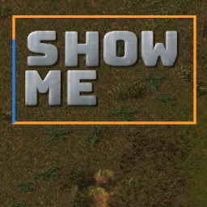

# *Currently in Development*
Please don't expect everything to work perfectly. However I'm very open to any suggestions and feedback! See below for how to submit feedback.

# Show Me - A digital pointer for Factorio

## Usage
Click on the shortcut in the toolbar to the right of the hotbar and then use the tool to select an area.
Shift-clicking will allow you to enter text that will be displayed underneath the selection.

There a two per-user settings that allow both the size and the duration of the selection box to be adjusted.

## Know Issues/Planned Updates
- There is no keyboard shortcut to open the tool (*a shortcut will be added in the next version*)

## Bug reports/feature requests
Please create an issue here for bug reports and/or feature requests.

